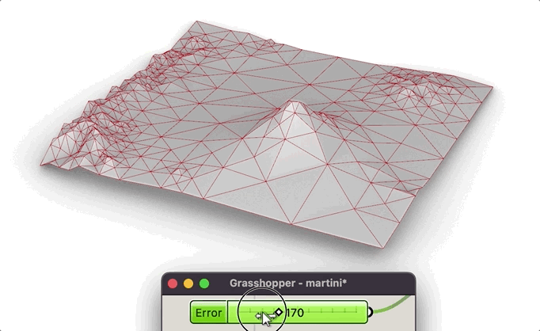

# GH MARTINI

Grasshopper plugin implementing csharp port of [MARTINI (Mapbox's Awesome Right-Triangulated Irregular Networks, Improved)](https://github.com/mapbox/martini/tree/main) algorithm.

```csharp
// Set up mesh generator for a certain 2^k+1 grid size
var martini = new Martini(257);

// Generate RTIN hierarchy from terrain data (a float array of size^2 length)
float[] terrainData = // Your terrain data;
Tile tile = martini.CreateTile(terrainData);

// Get a mesh (vertices and triangles indices) for a 10m error
double maxError = 10f;
MeshData mesh = tile.GetMesh(maxError);

// Convert to a Rhino Mesh
var mesh = new Mesh();
for (int i = 0; i < meshData.Vertices.Length; i += 3)
{
    mesh.Vertices.Add(meshData.Vertices[i], meshData.Vertices[i + 1], meshData.Vertices[i + 2]);
}

for (int i = 0; i < meshData.Triangles.Length; i += 3)
{
    int a = (int) meshData.Triangles[i];
    int b = (int) meshData.Triangles[i + 1];
    int c = (int) meshData.Triangles[i + 2];
    mesh.Faces.AddFace(a, b, c);
}
```



